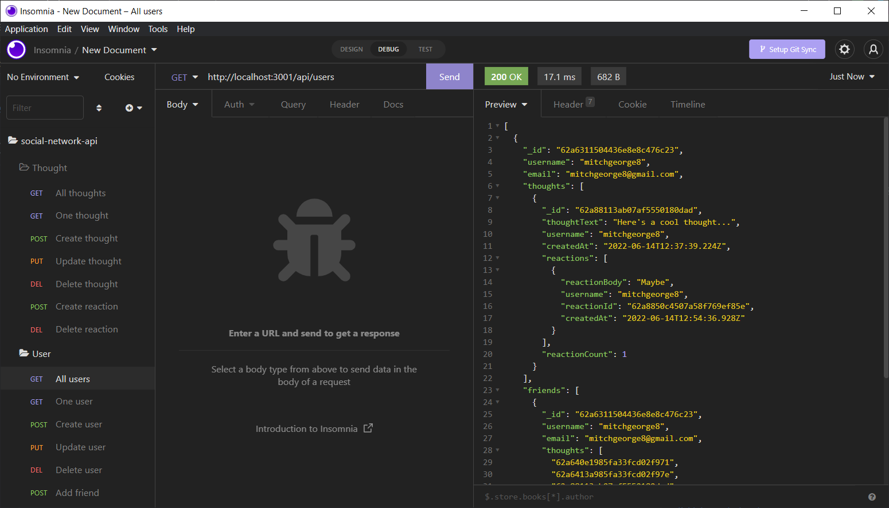

# Social Network API

## Table of Contents

  - [Description](#description)
  - [Installation](#installation)
  - [Usage](#usage)
  - [Credits](#credits)
  - [Version History](#version-history)
  - [License](#license)

## Description

MongoDB is a popular choice for many social networks due to its speed with large amounts of data and flexibility with unstructured data. Over the last part of this course, you’ll use several of the technologies that social networking platforms use in their full-stack applications. Because the foundation of these applications is data, it’s important that you understand how to build and structure the API first.

Your challenge is to build an API for a social network web application where users can share their thoughts, react to friends’ thoughts, and create a friend list. You’ll use Express.js for routing, a MongoDB database, and the Mongoose ODM. In addition to using the [Express.js](https://www.npmjs.com/package/express) and [Mongoose](https://www.npmjs.com/package/mongoose) packages, you may also optionally use a JavaScript date library of your choice or the native JavaScript Date object to format timestamps.

Because this application won’t be deployed, you’ll also need to create a walkthrough video that demonstrates its functionality and all of the following acceptance criteria being met. You’ll need to submit a link to the video and add it to the README of your project.

### User Story

```
AS A social media startup
I WANT an API for my social network that uses a NoSQL database
SO THAT my website can handle large amounts of unstructured data
```

### Acceptance Criteria

```
GIVEN a social network API
WHEN I enter the command to invoke the application
THEN my server is started and the Mongoose models are synced to the MongoDB database
WHEN I open API GET routes in Insomnia for users and thoughts
THEN the data for each of these routes is displayed in a formatted JSON
WHEN I test API POST, PUT, and DELETE routes in Insomnia
THEN I am able to successfully create, update, and delete users and thoughts in my database
WHEN I test API POST and DELETE routes in Insomnia
THEN I am able to successfully create and delete reactions to thoughts and add and remove friends to a user’s friend list
```

## Installation

1. Download this repository.
2. Open a command line and navigate to the root directory of this repository.
3. Run the command "npm install".
   - All of the necessary node packages will be installed.
4. Then run the command "npm start".
   - You should see a message that says "🌍 Connected on localhost:3001"

## Usage

Using [Insomnia](https://insomnia.rest/), you can now perform all necessary CRUD operations for a social network. Navigate to http://localhost:3001/api/users to get started. Using two main schemas, User and Thought, this is a fully functional back end api for a social networking platform.

[Walkthrough Video](https://drive.google.com/file/d/1Iqmi--AvM_biHFUDWCWHpAO1ekwPTgCd/view)

Screenshot:



## Credits

1. [Mitchell George](https://github.com/mitchgeorge8)

## Version History

- 1.0 - Initial release
  - See [commits](https://github.com/mitchgeorge8/social-network-api/commits)

## License

&copy; 2022 [Mitchell George](https://github.com/mitchgeorge8)

Permission is hereby granted, free of charge, to any person obtaining
a copy of this software and associated documentation files (the
"Software"), to deal in the Software without restriction, including
without limitation the rights to use, copy, modify, merge, publish,
distribute, sublicense, and/or sell copies of the Software, and to
permit persons to whom the Software is furnished to do so, subject to
the following conditions:

The above copyright notice and this permission notice shall be
included in all copies or substantial portions of the Software.

THE SOFTWARE IS PROVIDED "AS IS", WITHOUT WARRANTY OF ANY KIND,
EXPRESS OR IMPLIED, INCLUDING BUT NOT LIMITED TO THE WARRANTIES OF
MERCHANTABILITY, FITNESS FOR A PARTICULAR PURPOSE AND
NONINFRINGEMENT. IN NO EVENT SHALL THE AUTHORS OR COPYRIGHT HOLDERS BE
LIABLE FOR ANY CLAIM, DAMAGES OR OTHER LIABILITY, WHETHER IN AN ACTION
OF CONTRACT, TORT OR OTHERWISE, ARISING FROM, OUT OF OR IN CONNECTION
WITH THE SOFTWARE OR THE USE OR OTHER DEALINGS IN THE SOFTWARE.
